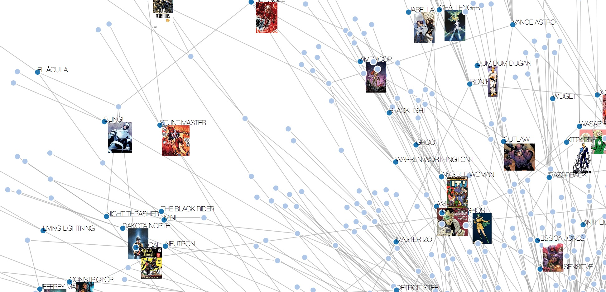
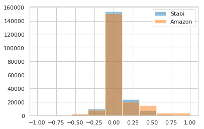

# CulturalAnalytics

Experiments and tutorials from the wide field of cultural analytics based on textual and multimodal corpora.

## Analyzing Unstructured Data

In this [tutorial](WikipediaTest.ipynb) you will learn to:

* [web/screen scrape](https://en.wikipedia.org/wiki/Web_scraping) relatively unstructured data from the Wikipedia
* transform unstructured data into tabular data to facilitate processing with Python
* create graph data from your data to visualize your data as networks
* export Python-created data to use it with JavaScript visualization libraries such as [D3.js](https://d3js.org/)

Would you should already know:

* a little Python 3
* some minor HTML
* some JavaScript if you want to understand the web-based visualization at the end of the tutorial

This notebook assumes that you are using [Anaconda](https://www.anaconda.com/download/) as your Python 3 distribution.

## Multimodal Analysis and Enrichment of a Library Metadata Corpus

This [notebook](Stabi_ImageAnalytics.ipynb) eventually evolved into a [TPDL publication](https://link.springer.com/chapter/10.1007%2F978-3-319-43997-6_24). _ATTENTION!_ The notebook is no longer maintained here. It has been moved to a separate [repository](https://github.com/elektrobohemian/SBBrowse2018).

* In this tutorial, you will learn to read metadata from an OAI-PMH data provider and how to convert the retrieved data from Dublin Core to a pandas data frame.
* Furthermore, you will carry out some basic data analysis on your data in order to find out if the data is corrupt or unclean. Based on an example, you will clean some aspects of your data using techniques borrowed from machine learning.
* Finally, you will visualize data with the help of a network graph.    

## Sentiment Analysis on the Berlin State Library Catalog and Amazon

In this [tutorial](sentimentAnalysis.ipynb), you will learn how to read from a unstructured and structured dataset, create a dataframe from this raw data, and to visualize characteristics from the data in order to find out whether the titles of a research library are truly neutral from a sentiment analysis perspective and how they compare to a sample from books sold by Amazon.
